# BotanicGarden Dataset
## A high-quality and large-scale robot navigation dataset in challenging natural environments

### Authors: 
[Yuanzhi Liu](https://github.com/lyzrose), [Yujia Fu](https://github.com/yayafu666)†, [Minghui Qin](https://github.com/SJTU-qin)†, [Yufeng Xu](https://github.com/feng15423)†, [Baoxin Xu](https://github.com/xbx1), et al. († Contributed equally)

<!-- 

 -->

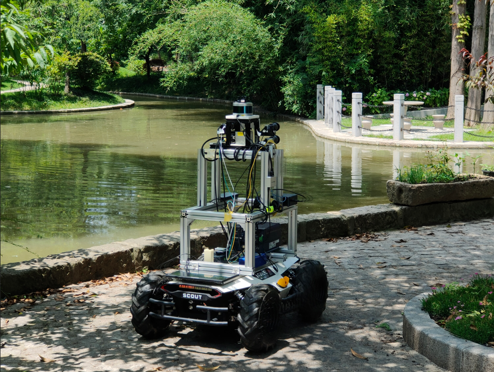

## Abstract: 
The rapid developments of mobile robotics and autonomous navigation over the years are largely empowered by public datasets for testing and upgradation, such as SLAM and localization tasks. Impressive demos and benchmark results have arisen, indicating the establishment of a mature technical framework. However, from the real-world deployments point of view, there are still critical defects of robustness in challenging environments, especially in large-scale, GNSS-denied, textural-monotonous, and unstructured scenarios. To meet the urgent validation demands in such scope, we build a novel challenging robot navigation dataset in a large botanic garden of more than 48000m2. Comprehensive sensors are employed, including high-res/rate stereo Gray&RGB cameras, rotational and forward 3D LiDARs, and low-cost and industrial-grade IMUs, all of which are well calibrated and hardware-synchronized to nanoseconds accuracy. An all-terrain wheeled robot is configured to mount the sensor suite and providing odometry data. A total of 33 long and short sequences of 2.3 million images are collected, covering scenes of thick woods, riversides, narrow paths, bridges, and grasslands that rarely appeared in previous resources. Excitedly, both highly-accurate ego-motions and 3D map ground truth are provided, along with fine-annotated vision semantics. Our goal is to contribute a high-quality dataset to advance robot navigation and sensor fusion research to a higher level.

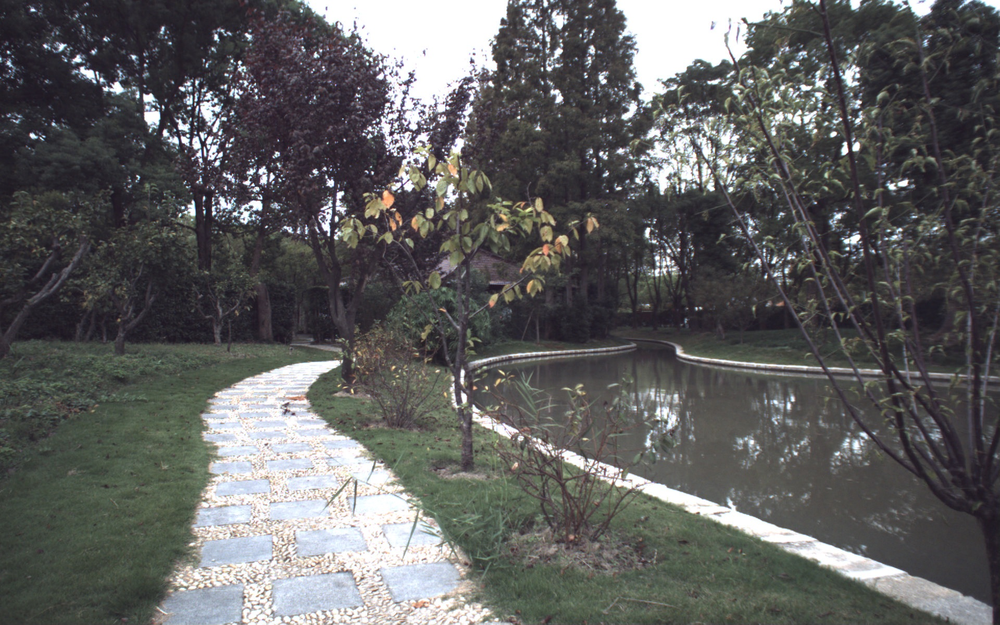
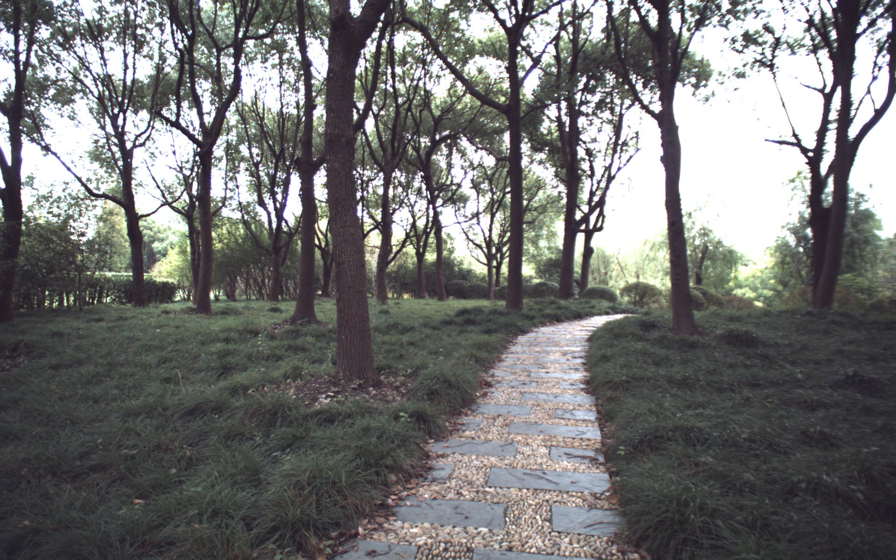
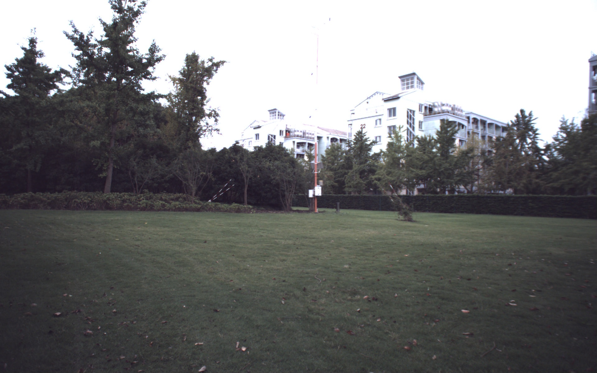

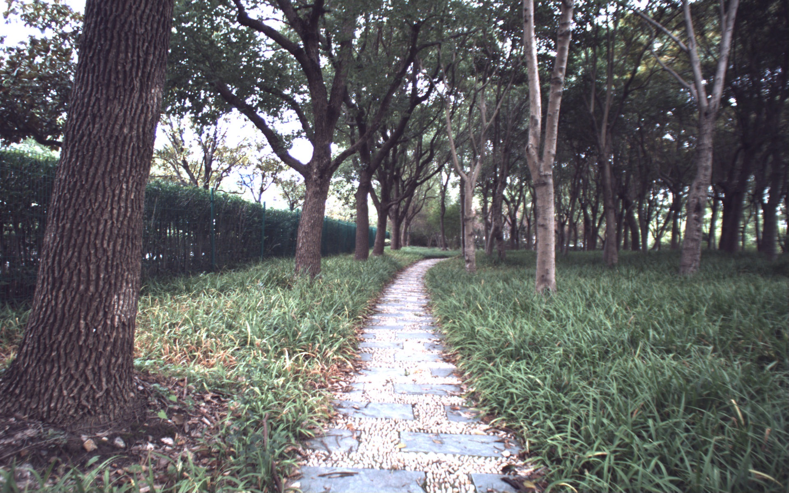
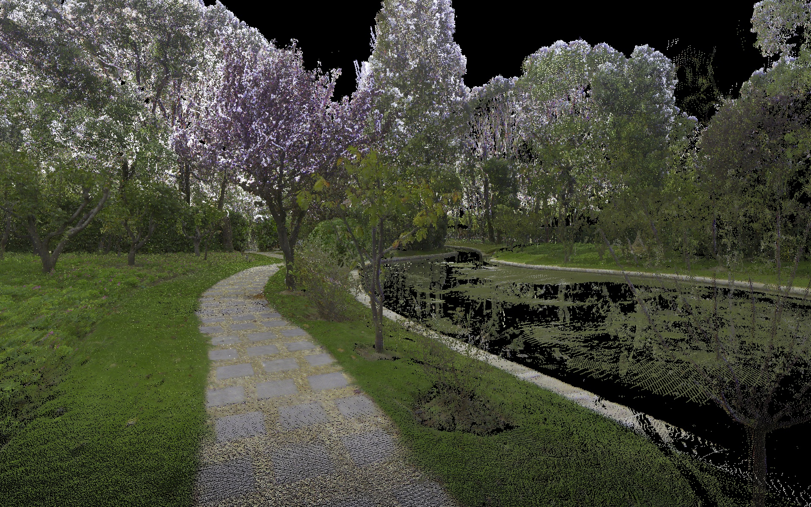
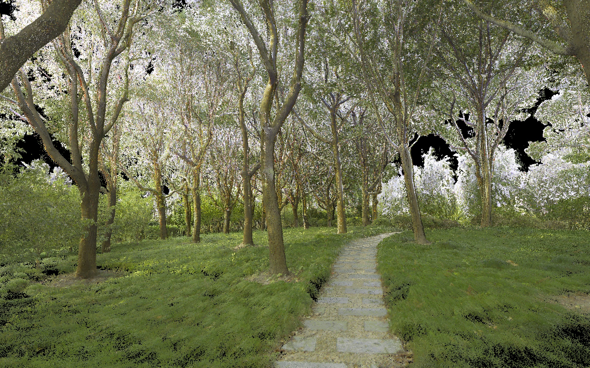

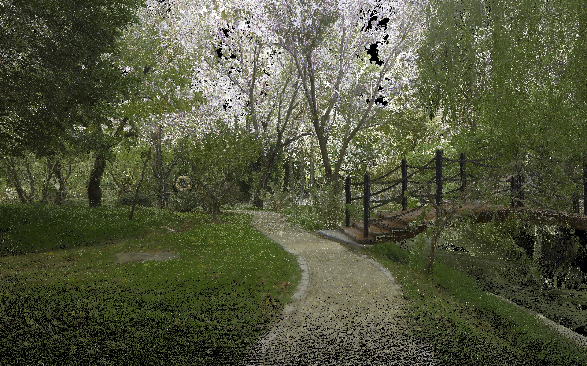
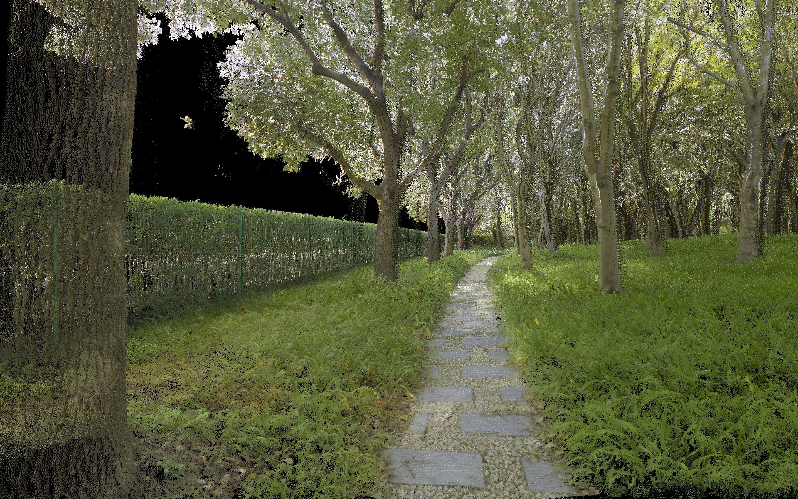
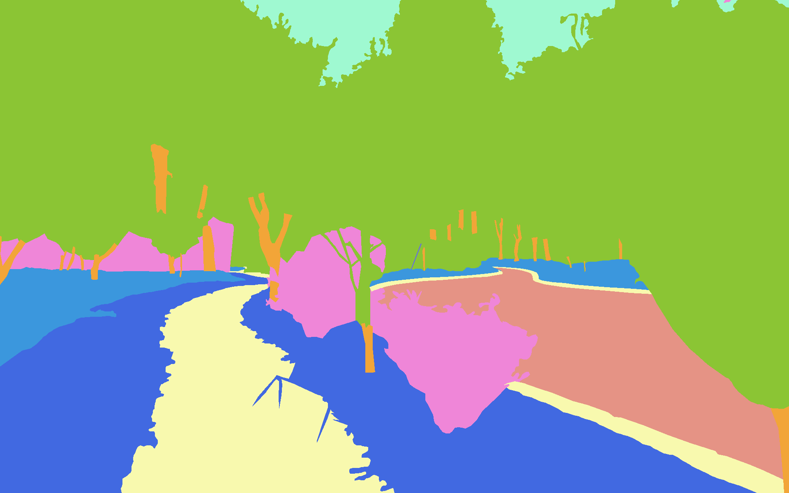

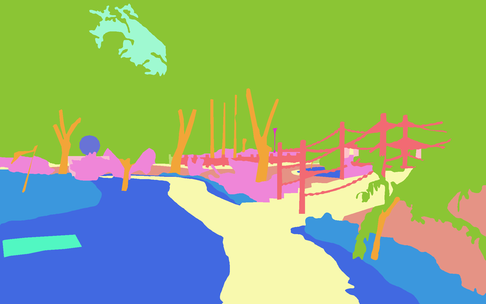

## Main Contributions: 
- We build a novel multi-sensory dataset in a large botanic garden, with a total of 33 long &short sequences and ~2.3 million images which contain diverse challenging natural factors that rarely seen in previous resources.
- We employed comprehensive sensors, including high-res and high-rate stereo Gray&RGB cameras, rotational and forward-facing 3D LiDARs, and low-cost and industrial-grade IMUs, supporting a wide range of applications. By elaborate development of the integrated system, we have achieved synchronization of nanoseconds accuracy. Both the sensors and sync-quality are at top-level of this field.
- We provide both highly-accurate 3D map and trajectories ground truth by dedicated surveying works and advanced map-based localization algorithm. We also provide dense vision semantics labeled by experienced annotators. This is the first robot navigation dataset that provides such all-rounded and high-quality reference data.

## Sensor Setup

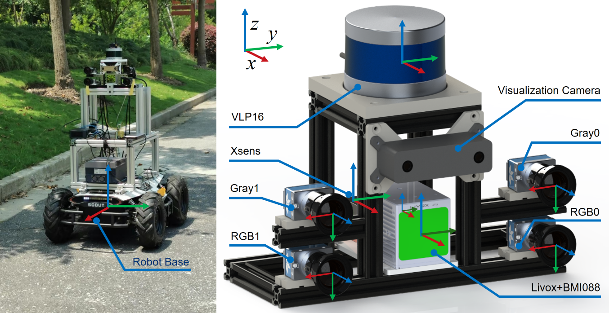

Sensor/Device|Model|Specification
:--:|:--:|:--:
Gray Stereo | DALSA M1930 | 1920*1200, 2/3", 71°×56°FoV, 40Hz
RGB Stereo | DALSA C1930 | 1920*1200, 2/3", 71°×56°FoV, 40Hz
LiDAR | Velodyne VLP16 | 16C, 360°×30°FoV, ±3cm@100m, 10Hz
MEMS LiDAR | Livox AVIA | 70°×77°FoV, ±2cm@200m, 10Hz
D-GNSS/INS | Xsens Mti-680G | 9-axis, 400Hz, GNSS not in use
Consumer IMU | BMI088 | 6-axis, 200Hz, Livox built-in
Wheel Encoder | Scout V1.0 | 4WD, 3-axis, 200Hz
GT 3D Scanner | Leica RTC360 | 130m range, 1mm+10ppm accuracy

## Time Synchronization

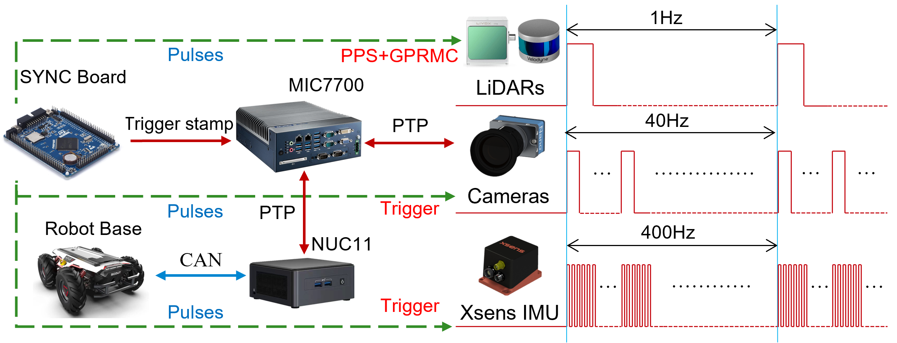

In a precise robot system with rich sensors and multi-hosts, time synchronization is extremely vital to eliminate perception delay and ensure navigation accuracy. Towards a high-quality dataset, we have taken very special cares on this problem. Our synchronization is based on a self-designed hardware trigger&timing board and a PTP-based network, as illustrated in the topological graph. The trigger and timing board is implemented by a compact MCU. It is programmed to produce three channels of pulses 1Hz-40Hz-400Hz in the very same phases. The 1Hz channel (pulse per second, PPS) is used for the synchronization of VLP-16 and AVIA accompanied with GPRMC signals; The 40Hz signal is used to trigger the cameras; And the 400Hz signal is used for triggering the Xsens IMU. The UTC time is maintained by MCU based on its onboard oscillator. Note that, to maintain the timing smoothness, we will never interrupt the MCU clock during the collections, instead, an UTC stamp will be conferred at the begin of each course-day via NTP or GNSS timing. So far, the LiDAR-camera-IMU chain has been completely synchronized in hardware, which can achieve nanoseconds accuracy as evaluated by the rising edge offset.

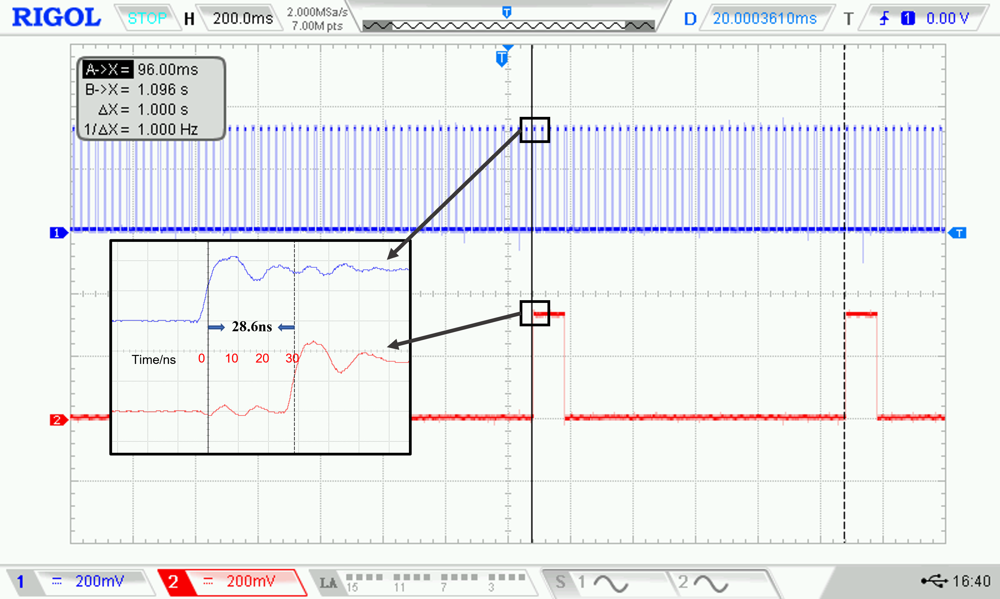

## Ground Truth Map
To ensure the global accuracy, we have not used any mobile-mapping based techniques (e.g., SLAM), instead we employ a tactical-grade stationary 3D laser scanner and conduct a qualified surveying and mapping job with professional colleagues from the College of Surveying and Geo-Informatics, Tongji University. The scanner is the RTC360 from Leica, which can output very dense and colored point cloud with a 130m scan radius and mm-level ranging accuracy, as shown the specifications in above table. The survey job takes in total 20 workdays and more than 900 individual scans, and get an accuracy of 11mm std. from Leica's report.

Some survey photos and registration works: 

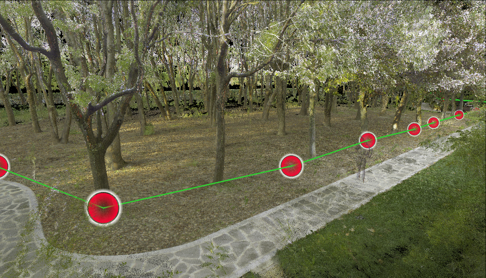

<!-- 

 -->

## Data Sequences
Our dataset consists of 33 data sequences in total. At present, we have comprehensively evaluated the state-of-the-arts(SOTA) on 7 sample sequences, the statistics and download links are listed below. [More sequences can be requested from Yuanzhi Liu via E-mail](#contact).
Stat/Sequence|1005-00|1005-01|1005-07|1006-01|1008-03|1018-00|1018-13
:--:|:--:|:--:|:--:|:--:|:--:|:--:|:--:
Duration/s|583.78|458.91|541.52|738.70|620.29|131.12|194.36
Distance/m|598.46|477.92|587.52|761.41|747.26|114.12|199.93
Size/GB1|66.8|49.0|59.8|83.1|71.0|13.0|20.9
rosbag2|[onedrive](https://goldensen-my.sharepoint.com/:f:/g/personal/yuanzhi_liu_goldensen_onmicrosoft_com/EikVXI6P489PvsdeKbHUL04Bk0I-TruLccL2_S3p_mniQQ?e=qf8DtH)|[onedrive](https://goldensen-my.sharepoint.com/:f:/g/personal/yuanzhi_liu_goldensen_onmicrosoft_com/EikVXI6P489PvsdeKbHUL04Bk0I-TruLccL2_S3p_mniQQ?e=qf8DtH)|[onedrive](https://goldensen-my.sharepoint.com/:f:/g/personal/yuanzhi_liu_goldensen_onmicrosoft_com/EikVXI6P489PvsdeKbHUL04Bk0I-TruLccL2_S3p_mniQQ?e=qf8DtH)|[onedrive](https://goldensen-my.sharepoint.com/:f:/g/personal/yuanzhi_liu_goldensen_onmicrosoft_com/EikVXI6P489PvsdeKbHUL04Bk0I-TruLccL2_S3p_mniQQ?e=qf8DtH)|[onedrive](https://goldensen-my.sharepoint.com/:f:/g/personal/yuanzhi_liu_goldensen_onmicrosoft_com/EikVXI6P489PvsdeKbHUL04Bk0I-TruLccL2_S3p_mniQQ?e=qf8DtH)|[onedrive](https://goldensen-my.sharepoint.com/:f:/g/personal/yuanzhi_liu_goldensen_onmicrosoft_com/EikVXI6P489PvsdeKbHUL04Bk0I-TruLccL2_S3p_mniQQ?e=qf8DtH)|[onedrive](https://goldensen-my.sharepoint.com/:f:/g/personal/yuanzhi_liu_goldensen_onmicrosoft_com/EikVXI6P489PvsdeKbHUL04Bk0I-TruLccL2_S3p_mniQQ?e=qf8DtH)
imagezip|[onedrive](https://goldensen-my.sharepoint.com/:f:/g/personal/yuanzhi_liu_goldensen_onmicrosoft_com/ErLnfSIwkQ1Gl7-1R5KOKfkBJ-yOn6i6xu4wqJBjC9tm_g?e=kIKnXM)|[onedrive](https://goldensen-my.sharepoint.com/:f:/g/personal/yuanzhi_liu_goldensen_onmicrosoft_com/EhjXa_7OTeZOpL7Io0cX8tgB39yEAwmLoLWC5yLt9yz3sw?e=rT2s44)|[onedrive](https://goldensen-my.sharepoint.com/:f:/g/personal/yuanzhi_liu_goldensen_onmicrosoft_com/EjazsKGZFNFHly72gfmde5UBvFTIfptaIKNawaNhzluPfw?e=cDxN3R)|[onedrive](https://goldensen-my.sharepoint.com/:f:/g/personal/yuanzhi_liu_goldensen_onmicrosoft_com/EonbrulnnoZEkRy6eJddszwBI2HOXUOWZlsMaXjbcyQy5Q?e=duz0Bv)|[onedrive](https://goldensen-my.sharepoint.com/:f:/g/personal/yuanzhi_liu_goldensen_onmicrosoft_com/Eup7na0wUEVCoDw4fXRY_WYB3ntGomPcNvkjZmJNubmI2A?e=y0S9Ij)|[onedrive](https://goldensen-my.sharepoint.com/:f:/g/personal/yuanzhi_liu_goldensen_onmicrosoft_com/EgMweUZ0JzpIv4skJBqIVAcBLtjuoJgih_nbTQdCl5FxIw?e=uEeGd1)|[onedrive](https://goldensen-my.sharepoint.com/:f:/g/personal/yuanzhi_liu_goldensen_onmicrosoft_com/Eqk4KUIjQTlGvfKyPKgWPiQBvnb5pFS_5XVlRVGwP4RARg?e=ddXR5V)

The rostopics and corresponding message types are listed below:
<!-- ROS Topic|Message Type|Description
:--:|:--:|:--:
/dalsa/rgb0/image_raw|sensor_msgs/Image|Left RGB camera
/dalsa/rgb1/image_raw|sensor_msgs/Image|Right RGB camera
/dalsa/gray0/image_raw|sensor_msgs/Image|Left Gray camera
/dalsa/gray1/image_raw|sensor_msgs/Image|Right Gray camera
/velodyne_points|sensor_msgs/PointCloud2|Velodyne VLP16 LiDAR
/livox/lidar|livox_ros_driver/CustomMsg|Livox AVIA LiDAR
/imu/data|sensor_msgs/Imu|Xsens IMU
/livox/imu|sensor_msgs/Imu|Livox BMI088 IMU
/gt/poses|geometry_msgs/PoseStamped|Ground truth poses -->
ROS Topic|Message Type|Description
:--:|:--:|:--:
/dalsa_rgb/left/image_raw|sensor_msgs/Image|Left RGB camera
/dalsa_rgb/right/image_raw|sensor_msgs/Image|Right RGB camera
/dalsa_gray/left/image_raw|sensor_msgs/Image|Left Gray camera
/dalsa_gray/right/image_raw|sensor_msgs/Image|Right Gray camera
/velodyne_points|sensor_msgs/PointCloud2|Velodyne VLP16 LiDAR
/livox/lidar|livox_ros_driver/CustomMsg|Livox AVIA LiDAR
/imu/data|sensor_msgs/Imu|Xsens IMU
/livox/imu|sensor_msgs/Imu|Livox BMI088 IMU
/gt_poses|geometry_msgs/PoseStamped|Ground truth poses

1Imagezip and no-vision rosbag size.
2The rosbags contain downsampled vision data (960x600@20Hz) to ease the downloads. Full res&rate frames (1920x1200@40Hz) are available in raw imagezips.

## Ground Truth Trajectories

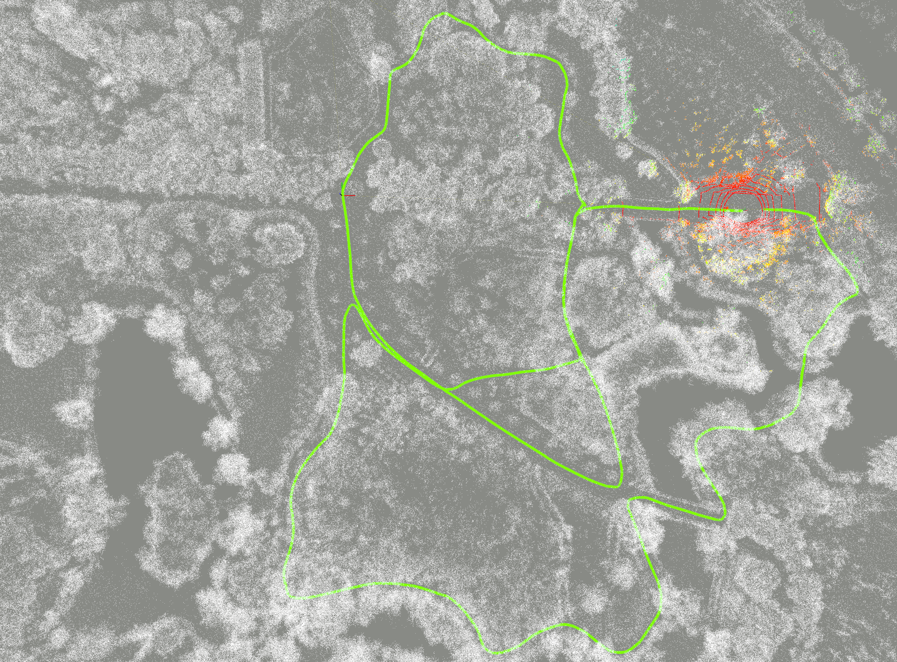

## State-Of-The-Art Evaluation
We have tested the performance of visual ([ORB-SLAM3](https://github.com/UZ-SLAMLab/ORB_SLAM3)), visual-inertial ([ORB-SLAM3](https://github.com/UZ-SLAMLab/ORB_SLAM3), [VINS-Mono](https://github.com/HKUST-Aerial-Robotics/VINS-Mono)), LiDAR ([LOAM](https://github.com/HKUST-Aerial-Robotics/A-LOAM)), LiDAR-inertial ([Fast-LIO2](https://github.com/hku-mars/FAST_LIO)), and visual-LiDAR-inertial fusion ([LVI-SAM](https://github.com/TixiaoShan/LVI-SAM), [R3LIVE](https://github.com/hku-mars/r3live)) systems on the above 7 sample sequences, as listed below the evaluation statistics.

<table>
    <tr> <!-- 第1行数据 -->
        <td style="text-align:center"> Sequence </td>  <!-- 第1列 -->
        <td style="text-align:center" colspan="2"> 1005-00 </td> <!-- 第2列 合并了 2 列 -->
        <td style="text-align:center" colspan="2"> 1005-01 </td> <!-- 第4列 合并了 2 列 -->
        <td style="text-align:center" colspan="2"> 1005-07 </td> <!-- 第6列 合并了 2 列 -->
        <td style="text-align:center" colspan="2"> 1006-01 </td> <!-- 第8列 合并了 2 列 -->
        <td style="text-align:center" colspan="2"> 1008-03 </td> <!-- 第10列 合并了 2 列 -->
        <td style="text-align:center" colspan="2"> 1018-00 </td> <!-- 第12列 合并了 2 列 -->
        <td style="text-align:center" colspan="2"> 1018-13 </td> <!-- 第14列 合并了 2 列 -->
    </tr>
    <tr> <!-- 第2行数据 -->
        <td style="text-align:center"> Method/Metric </td>  <!-- 第1列 -->
        <td style="text-align:center"> RPE/% </td>  <!-- 第2列 -->
        <td style="text-align:center"> ATE/m </td>  <!-- 第3列 -->
        <td style="text-align:center"> RPE/% </td>  <!-- 第4列 -->
        <td style="text-align:center"> ATE/m </td>  <!-- 第5列 -->
        <td style="text-align:center"> RPE/% </td>  <!-- 第6列 -->
        <td style="text-align:center"> ATE/m </td>  <!-- 第7列 -->
        <td style="text-align:center"> RPE/% </td>  <!-- 第8列 -->
        <td style="text-align:center"> ATE/m </td>  <!-- 第9列 -->
        <td style="text-align:center"> RPE/% </td>  <!-- 第10列 -->
        <td style="text-align:center"> ATE/m </td>  <!-- 第11列 -->
        <td style="text-align:center"> RPE/% </td>  <!-- 第12列 -->
        <td style="text-align:center"> ATE/m </td>  <!-- 第13列 -->
        <td style="text-align:center"> RPE/% </td>  <!-- 第14列 -->
        <td style="text-align:center"> ATE/m </td>  <!-- 第15列 -->
    </tr>
    <tr> <!-- 第3行数据 -->
        <td style="text-align:center"> ORB-SLAM3-S </td>  <!-- 第1列 -->
        <td style="text-align:center"> X </td>  <!-- 第2列 -->
        <td style="text-align:center"> X </td>  <!-- 第3列 -->
        <td style="text-align:center"> 5.586 NC </td>  <!-- 第4列 -->
        <td style="text-align:center"> 5.933 NC</td>  <!-- 第5列 -->
        <td style="text-align:center"> X </td>  <!-- 第6列 -->
        <td style="text-align:center"> X </td>  <!-- 第7列 -->
        <td style="text-align:center"> 4.143 LC </td>  <!-- 第8列 -->
        <td style="text-align:center"> 3.453 LC </td>  <!-- 第9列 -->
        <td style="text-align:center"> 4.148 LC </td>  <!-- 第10列 -->
        <td style="text-align:center"> 5.005 LC </td>  <!-- 第11列 -->
        <td style="text-align:center"> 5.220 NC </td>  <!-- 第12列 -->
        <td style="text-align:center"> 1.466 NC </td>  <!-- 第13列 -->
        <td style="text-align:center"> 5.303 NC </td>  <!-- 第14列 -->
        <td style="text-align:center"> 2.818 NC </td>  <!-- 第15列 -->
    </tr>
    <tr> <!-- 第4行数据 -->
        <td style="text-align:center"> ORB-SLAM3-SI </td>  <!-- 第1列 -->
        <td style="text-align:center"> 4.386 NC </td>  <!-- 第2列 -->
        <td style="text-align:center"> 5.511 NC </td>  <!-- 第3列 -->
        <td style="text-align:center"> 4.808 NC </td>  <!-- 第4列 -->
        <td style="text-align:center"> 5.376 NC </td>  <!-- 第5列 -->
        <td style="text-align:center"> 4.771 NC </td>  <!-- 第6列 -->
        <td style="text-align:center"> 5.283 NC </td>  <!-- 第7列 -->
        <td style="text-align:center"> 3.733 LC </td>  <!-- 第8列 -->
        <td style="text-align:center"> 3.150 LC </td>  <!-- 第9列 -->
        <td style="text-align:center"> 3.853 LC </td>  <!-- 第10列 -->
        <td style="text-align:center"> 4.311 LC </td>  <!-- 第11列 -->
        <td style="text-align:center"> 4.118 LC </td>  <!-- 第12列 -->
        <td style="text-align:center"> 1.116 LC </td>  <!-- 第13列 -->
        <td style="text-align:center"> 4.238 NC </td>  <!-- 第14列 -->
        <td style="text-align:center"> 2.967 NC </td>  <!-- 第15列 -->
    </tr>
    <tr> <!-- 第5行数据 -->
        <td style="text-align:center"> VINS-Mono </td>  <!-- 第1列 -->
        <td style="text-align:center"> 3.403 NC </td>  <!-- 第2列 -->
        <td style="text-align:center"> 8.617 NC </td>  <!-- 第3列 -->
        <td style="text-align:center"> 2.383 NC </td>  <!-- 第4列 -->
        <td style="text-align:center"> 4.029 NC </td>  <!-- 第5列 -->
        <td style="text-align:center"> 3.694 NC </td>  <!-- 第6列 -->
        <td style="text-align:center"> 7.819 NC </td>  <!-- 第7列 -->
        <td style="text-align:center"> 3.101 LC </td>  <!-- 第8列 -->
        <td style="text-align:center"> 2.318 LC </td>  <!-- 第9列 -->
        <td style="text-align:center"> 3.475 LC </td>  <!-- 第10列 -->
        <td style="text-align:center"> 3.620 LC </td>  <!-- 第11列 -->
        <td style="text-align:center"> 3.859 NC </td>  <!-- 第12列 -->
        <td style="text-align:center"> 1.767 NC </td>  <!-- 第13列 -->
        <td style="text-align:center"> 5.588 NC </td>  <!-- 第14列 -->
        <td style="text-align:center"> 2.967 NC </td>  <!-- 第15列 -->
    </tr>
    <tr> <!-- 第6行数据 -->
        <td style="text-align:center"> LOAM </td>  <!-- 第1列 -->
        <td style="text-align:center"> 1.993 </td>  <!-- 第2列 -->
        <td style="text-align:center"> 3.744 </td>  <!-- 第3列 -->
        <td style="text-align:center"> 2.589 </td>  <!-- 第4列 -->
        <td style="text-align:center"> 5.624 </td>  <!-- 第5列 -->
        <td style="text-align:center"> 2.293 </td>  <!-- 第6列 -->
        <td style="text-align:center"> 3.253 </td>  <!-- 第7列 -->
        <td style="text-align:center"> 2.188 </td>  <!-- 第8列 -->
        <td style="text-align:center"> 2.553 </td>  <!-- 第9列 -->
        <td style="text-align:center"> 2.046 </td>  <!-- 第10列 -->
        <td style="text-align:center"> 2.994 </td>  <!-- 第11列 -->
        <td style="text-align:center"> 2.530 </td>  <!-- 第12列 -->
        <td style="text-align:center"> 0.523 </td>  <!-- 第13列 -->
        <td style="text-align:center"> 2.441 </td>  <!-- 第14列 -->
        <td style="text-align:center"> 1.330 </td>  <!-- 第15列 -->
    </tr>
    <tr> <!-- 第7行数据 -->
        <td style="text-align:center"> FAST-LIO2 </td>  <!-- 第1列 -->
        <td style="text-align:center"> 1.827 </td>  <!-- 第2列 -->
        <td style="text-align:center"> 2.305 </td>  <!-- 第3列 -->
        <td style="text-align:center"> 1.870 </td>  <!-- 第4列 -->
        <td style="text-align:center"> 2.470 </td>  <!-- 第5列 -->
        <td style="text-align:center"> 2.349 </td>  <!-- 第6列 -->
        <td style="text-align:center"> 4.438 </td>  <!-- 第7列 -->
        <td style="text-align:center"> 6.573 </td>  <!-- 第8列 -->
        <td style="text-align:center"> 39.733 </td>  <!-- 第9列 -->
        <td style="text-align:center"> 2.404 </td>  <!-- 第10列 -->
        <td style="text-align:center"> 4.019 </td>  <!-- 第11列 -->
        <td style="text-align:center"> 2.770 </td>  <!-- 第12列 -->
        <td style="text-align:center"> 2.154 </td>  <!-- 第13列 -->
        <td style="text-align:center"> 2.562 </td>  <!-- 第14列 -->
        <td style="text-align:center"> 2.390 </td>  <!-- 第15列 -->
    </tr>
    <tr> <!-- 第8行数据 -->
        <td style="text-align:center"> LVI-SAM </td>  <!-- 第1列 -->
        <td style="text-align:center"> 1.899 </td>  <!-- 第2列 -->
        <td style="text-align:center"> 2.774 </td>  <!-- 第3列 -->
        <td style="text-align:center"> 2.033 </td>  <!-- 第4列 -->
        <td style="text-align:center"> 2.640 </td>  <!-- 第5列 -->
        <td style="text-align:center"> 2.295 </td>  <!-- 第6列 -->
        <td style="text-align:center"> 3.232 </td>  <!-- 第7列 -->
        <td style="text-align:center"> 2.004 </td>  <!-- 第8列 -->
        <td style="text-align:center"> 1.700 </td>  <!-- 第9列 -->
        <td style="text-align:center"> 1.799 </td>  <!-- 第10列 -->
        <td style="text-align:center"> 1.798 </td>  <!-- 第11列 -->
        <td style="text-align:center"> 2.595 </td>  <!-- 第12列 -->
        <td style="text-align:center"> 0.700 </td>  <!-- 第13列 -->
        <td style="text-align:center"> 2.565 </td>  <!-- 第14列 -->
        <td style="text-align:center"> 1.061 </td>  <!-- 第15列 -->
    </tr>
    <tr> <!-- 第9行数据 -->
        <td style="text-align:center"> R3LIVE </td>  <!-- 第1列 -->
        <td style="text-align:center"> 1.924 </td>  <!-- 第2列 -->
        <td style="text-align:center"> 3.300 </td>  <!-- 第3列 -->
        <td style="text-align:center"> 1.907 </td>  <!-- 第4列 -->
        <td style="text-align:center"> 2.259 </td>  <!-- 第5列 -->
        <td style="text-align:center"> 2.197 </td>  <!-- 第6列 -->
        <td style="text-align:center"> 3.799 </td>  <!-- 第7列 -->
        <td style="text-align:center"> 2.192 </td>  <!-- 第8列 -->
        <td style="text-align:center"> 7.051 </td>  <!-- 第9列 -->
        <td style="text-align:center"> 2.077 </td>  <!-- 第10列 -->
        <td style="text-align:center"> 2.776 </td>  <!-- 第11列 -->
        <td style="text-align:center"> 2.462 </td>  <!-- 第12列 -->
        <td style="text-align:center"> 0.875 </td>  <!-- 第13列 -->
        <td style="text-align:center"> 2.779 </td>  <!-- 第14列 -->
        <td style="text-align:center"> 1.318 </td>  <!-- 第15列 -->
    </tr>
</table>

<!-- Method/Metric|1005-00|1005-01|1005-07|1006-01|1008-03|1018-00|1018-13
:--:|:--:|:--:|:--:|:--:|:--:|:--:|:--: -->

## Config Files
To simplify the user testing procedure, We have provided the calibration and config files of the State-Of-The-Arts, which can be accessed in [calib](./calib/) and [config](./config/) folders.

Testing of [LVI-SAM](https://github.com/Cc19245/LVI-SAM-Easyused) on 1005-00 sequence:

## Semantic Dense Annotations
All data are provided in LabelMe format and support future reproducing. It is expected that these data can strengthen the abilities of robust motion estimation and semantic map paintings.

<!-- 

 -->

## Toolbox
### Rosbag Conversion
Our dataset is captured in rosbag and raw formats. For the convenience of usage, we have provided a toolbox to convert between different structures, check the [rosbag_tools](./rosbag_tools/) folder for usage.
### Semantic Conversion
The semantics are labelled in LabelMe json format. For the convenience of usage, we have provided a toolbox to convert to PASCAL VOC and MS COCO formats, check the [semantic_tools](./semantic_tools/) folder for usage.
### Calibration Tool
We have designed a concise toolbox for camera-LiDAR calibration based on several 2D checker boards, check the [calibration_tools](./calibration_tools/) folder for usage.
### Evaluation
We recommend to use the open-source tool [EVO](https://github.com/MichaelGrupp/evo) for algorithm evaluation. Our Ground truth Poses are provided in TUM format consisting of timestamps, translations x-y-z, and quaternions x-y-z-w, which are concise and enable trajactory alignment based on time correspondances. Note that, the GT poses are tracking the VLP16 frame, so you must transform your poses to VLP16 side by hand-eye formula ***AX=XB*** before evaluation.

## Acknowledgement
The authors would like to thank the colleagues from TongJi University and Sun Yat-sen University for their assistances in the rigorous survey works and post-processings, especially Xiaohang Shao, Chen Chen, and Kunhua Liu. We also thank A/Prof. Hangbin Wu for his guidance in data collection. Besides, we acknowledge Grace Xu from Livox for the support on Avia LiDAR, we acknowledge Claude Ng from Leica for the support on high-definition surveying, and we appreciate the colleagues of Appen for their professional works in visual semantic annotations. Yuanzhi Liu would like to thank Chenbo Gong for scene preparation work, and thank Jingxin Dong for her job-loggings and photographs during our data collection.

## Funding
This work was supported by National Key R&D Program of China under Grant 2018YFB1305005.

## Timeline
Feb &ensp;6, 2023         &emsp; Open the GitHub website: https://github.com/robot-pesg/BotanicGarden 
Feb 10, 2023         &emsp; Rosbag tools open-sourced 
Feb 13, 2023         &emsp; Semantic tools open-sourced 
Feb 14, 2023         &emsp; Calibration params available 
Feb 17, 2023         &emsp; Calibration tools open-sourced 
Feb 18, 2023         &emsp; Paper submitted to IEEE Robotics and Automation Letters (RA-L) 
Sep 18, 2023         &emsp; Trajectories info updated 
Sep 20, 2023         &emsp; More sequences available 

## Contact
This dataset is provided for academic purposes. If you meet some technical problems, please open an issue or contact <Yuanzhi Liu: lyzrose@sjtu.edu.cn> and <Yufeng Xu: xuyufeng@sjtu.edu.cn>.

## Citation
The preprint version of our paper is already available on [arXiv](https://arxiv.org/abs/2306.14137). If our data/code/tool/knowledge helps your research, please cite:  

Liu, Y., Fu, Y., Qin, M., Xu, Y., Xu, B., Chen, F., Goossens, B., Yu, H., Chen, L., Liu, C., Tao, W., Zhao, H. (2023). BotanicGarden: A high-quality and large-scale robot navigation dataset in challenging natural environments. arXiv preprint arXiv:2306.14137.
